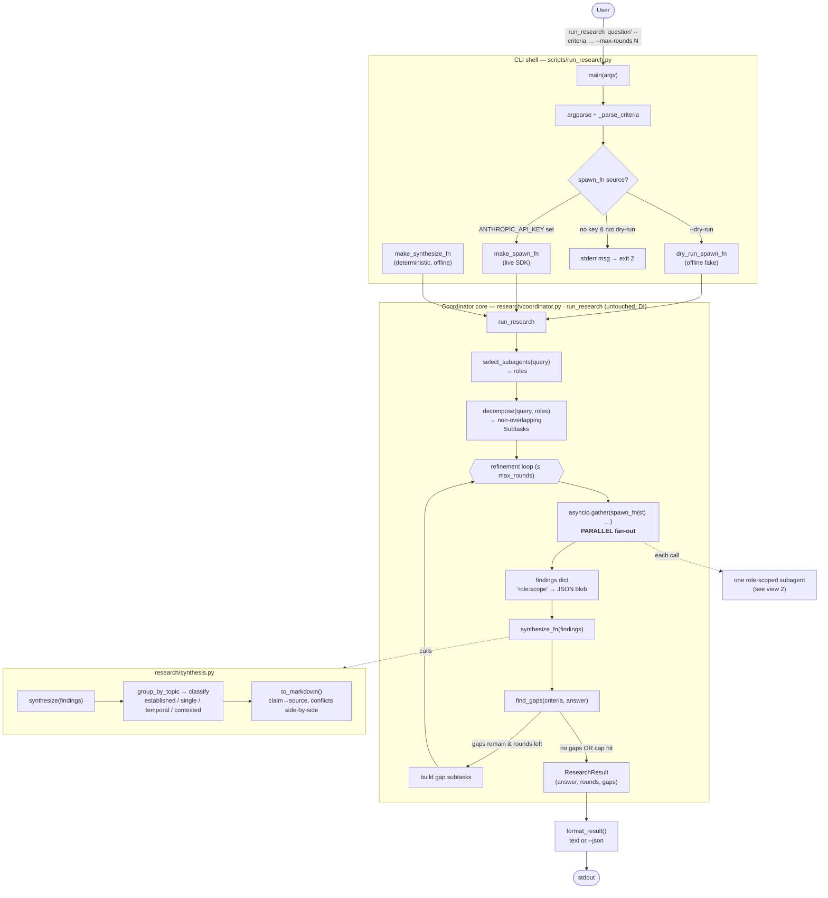
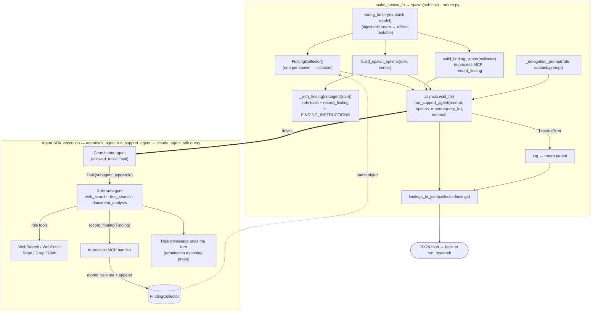
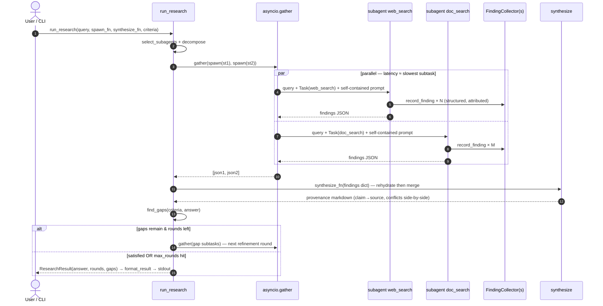

# SA-39 — Live research agent architecture

How a research question flows from the command line through the deterministic coordinator,
fans out to **role-scoped subagents running in parallel via the Agent SDK**, captures
structured findings, and is synthesised into one provenance-preserving answer.

Three views: (1) end-to-end control flow, (2) what one `spawn_fn` does (the agentic core),
(3) a dynamic sequence of one refinement round.

---

## 1. End-to-end control flow

The CLI is a thin blocking shell; **`run_research` owns orchestration** (unchanged, DI'd); the
real SDK adapters live in `runner.py`. Parallelism is the `asyncio.gather` fan-out; the
refinement loop is bounded by `max_rounds` (a logged safety net, not the primary stop).

---

## 2. Inside one `spawn_fn` — the agentic core (live path)

Each `spawn(subtask)` launches **one** role-scoped subagent through the SDK `Task` tool. The
subagent inherits no coordinator context (the full `Subtask.prompt` is passed in) and is offered
only its role tools **plus** the in-process `record_finding` tool. Findings are captured
**structurally** (one `record_finding` call per claim), never by parsing prose. A per-subtask
`asyncio.wait_for` timeout guarantees a hung subagent can never hang the blocking CLI.

> **Why the relay works:** Task-spawned subagents inherit the parent `ClaudeAgentOptions.mcp_servers`,
> so the subagent can call `mcp__research__record_finding`; the handler appends to the per-spawn
> `FindingCollector` closure. (Verified against the Agent SDK docs during review.)

---

## 3. Dynamic sequence — one round, two parallel subagents

Shows the parallel fan-out (wall-clock ≈ slowest subtask, not the sum), structured capture, the
synthesis merge, and the gap-driven decision to refine or finish.

---

## File → responsibility legend

| Component | File | Role |
|---|---|---|
| CLI shell | `scripts/run_research.py` | parse args, gate live/dry-run, `asyncio.run`, print |
| Orchestrator | `src/research/coordinator.py` | `run_research`: select → decompose → gather → synthesise → refine (DI, untouched) |
| Live adapters | `src/research/runner.py` | real `spawn_fn`/`synthesize_fn`, `record_finding` MCP server, Task wiring, JSON bridge, timeout |
| SDK harness | `src/agent/sdk_agent.py` | `run_support_agent` consumes the `query()` message stream (SDK owns the loop) |
| Agent specs | `src/research/agents.py` | `COORDINATOR` (tool: `Task`) + role-scoped `SUBAGENTS`; `build_agent_definitions` |
| Findings | `src/research/schemas.py` | `Finding` contract, `finding_tool_def`, `FINDING_INSTRUCTIONS` |
| Synthesis | `src/research/synthesis.py` | group → classify → provenance-preserving markdown |
